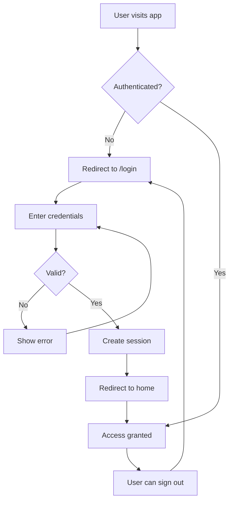

# Authentication Setup Guide

## Overview
The POI Translation Portal now includes a complete email-based authentication system using Supabase Auth. All pages require authentication except for the login page.

## Default Admin Credentials
- **Email**: `tna_planning_tw@klook.com`
- **Password**: `Taipeitna2025!Klook`

## Architecture

### Components
1. **Login Page** (`/app/login/page.tsx`)
   - Email and password authentication
   - Auto-redirect to main app after successful login
   - Development mode includes quick-fill for admin credentials

2. **Middleware** (`/middleware.ts`)
   - Protects all routes except `/login` and API routes
   - Automatically redirects unauthenticated users to login
   - Redirects authenticated users from login page to home

3. **Auth Provider** (`/app/providers/auth-provider.tsx`)
   - Global authentication state management
   - Provides user context throughout the application
   - Handles sign out functionality

4. **User Menu** (`/components/user-menu.tsx`)
   - Displays current user email
   - Provides sign out option
   - Located in the top-right corner of the main application

## Setup Instructions

### 1. Environment Variables
Ensure your `.env.local` file contains:
```bash
NEXT_PUBLIC_SUPABASE_URL=your_supabase_url
NEXT_PUBLIC_SUPABASE_ANON_KEY=your_supabase_anon_key
# Optional: For admin user creation script
SUPABASE_SERVICE_ROLE_KEY=your_service_role_key
```

### 2. Create Admin User

#### Option A: Using Node.js Script (Recommended)
```bash
# Install dependencies if not already installed
npm install

# Run the admin setup script
node scripts/setup-admin.js
```

#### Option B: Using Supabase Dashboard
1. Go to your Supabase project dashboard
2. Navigate to Authentication > Users
3. Click "Invite user" or "Add user"
4. Enter:
   - Email: `tna_planning_tw@klook.com`
   - Password: `Taipeitna2025!Klook`

#### Option C: Using SQL (After user is created)
Run the SQL script in Supabase SQL Editor:
```bash
# The setup-admin-user.sql file contains:
# - Profile table creation
# - RLS policies
# - Trigger for automatic profile creation
```

### 3. Database Setup (Optional but Recommended)
Run the following in Supabase SQL Editor to set up user profiles:

```sql
-- This creates a profiles table and necessary triggers
-- Full script available in setup-admin-user.sql
```

## Authentication Flow



## Key Features

### Session Management
- Sessions persist across browser refreshes
- Auto-refresh tokens for extended sessions
- Secure cookie-based session storage

### Route Protection
- All routes protected by default
- API routes accessible without authentication
- Static assets and Next.js internals excluded from protection

### User Experience
- Loading states during authentication checks
- Smooth transitions between authenticated/unauthenticated states
- Clear error messages for failed login attempts
- User email displayed in navigation menu

## Security Considerations

1. **Password Requirements**
   - The default admin password meets strong password criteria
   - Includes uppercase, lowercase, numbers, and special characters
   - Minimum 8 characters

2. **Session Security**
   - Sessions stored in httpOnly cookies
   - Automatic token refresh prevents session expiry
   - Sign out clears all session data

3. **Middleware Protection**
   - Runs on every request
   - Validates authentication server-side
   - Prevents unauthorized access to protected routes

## Customization

### Hide/Show Registration
Currently, the registration link is commented out in the login page. To enable user registration:

1. Uncomment the registration link in `/app/login/page.tsx`
2. Create a registration page at `/app/register/page.tsx`
3. Update middleware to allow access to `/register` without authentication

### Modify Admin Email
To use a different admin email, update:
1. `scripts/setup-admin.js` - ADMIN_EMAIL constant
2. `setup-admin-user.sql` - Email references
3. `/app/login/page.tsx` - fillAdminCredentials function (dev only)

### Add Role-Based Access Control
To implement different user roles:
1. Add role field to profiles table
2. Update auth context to include user role
3. Create role-checking utilities
4. Implement conditional rendering based on roles

## Troubleshooting

### Common Issues

1. **Cannot log in with admin credentials**
   - Verify the user exists in Supabase Dashboard
   - Check if email confirmation is required in Auth settings
   - Reset password through Supabase Dashboard if needed

2. **Redirect loops**
   - Clear browser cookies and local storage
   - Check middleware configuration
   - Verify Supabase URL and keys are correct

3. **Session not persisting**
   - Ensure cookies are enabled in browser
   - Check Supabase auth settings for session duration
   - Verify localStorage is available

### Debug Mode
To enable authentication debugging:
1. Open browser developer console
2. Check Network tab for auth requests
3. Look for auth-related errors in Console
4. Verify cookies in Application > Cookies

## Next Steps

1. **Test the authentication flow**:
   ```bash
   npm run dev
   # Visit http://localhost:3000
   # You should be redirected to /login
   ```

2. **Create additional users** as needed through:
   - Supabase Dashboard
   - Custom registration page
   - Admin user management interface

3. **Implement additional features**:
   - Password reset functionality
   - Email verification
   - Two-factor authentication
   - User profile management

## Support
For issues or questions about the authentication system:
1. Check Supabase documentation: https://supabase.com/docs/guides/auth
2. Review the middleware logs in development
3. Inspect browser console for client-side errors